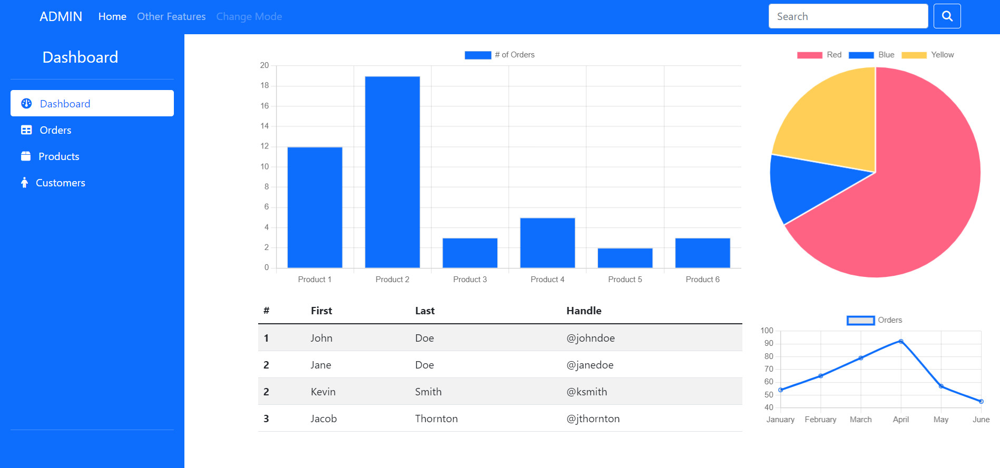

# Basic Admin Dashboard

This repository contains a basic admin dashboard page created using Bootstrap, Font Awesome icons, and Chart.js for graphics.

## Features

- **Bootstrap**: Utilized for layout and styling.
- **Font Awesome Icons**: Enhances visual elements.
- **Chart.js**: Provides simple charts and graphs.

## Getting Started

To view the admin dashboard, simply open the `index.html` file in your web browser.

## Screenshot

